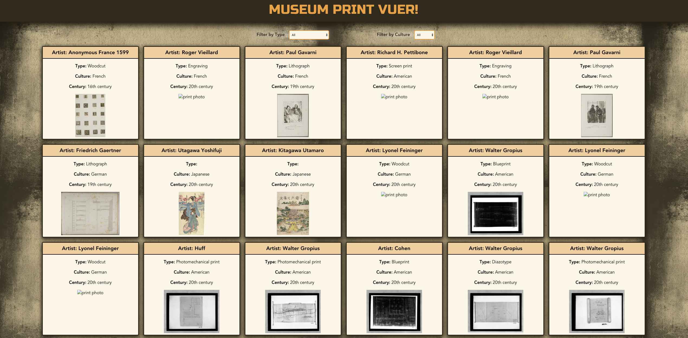
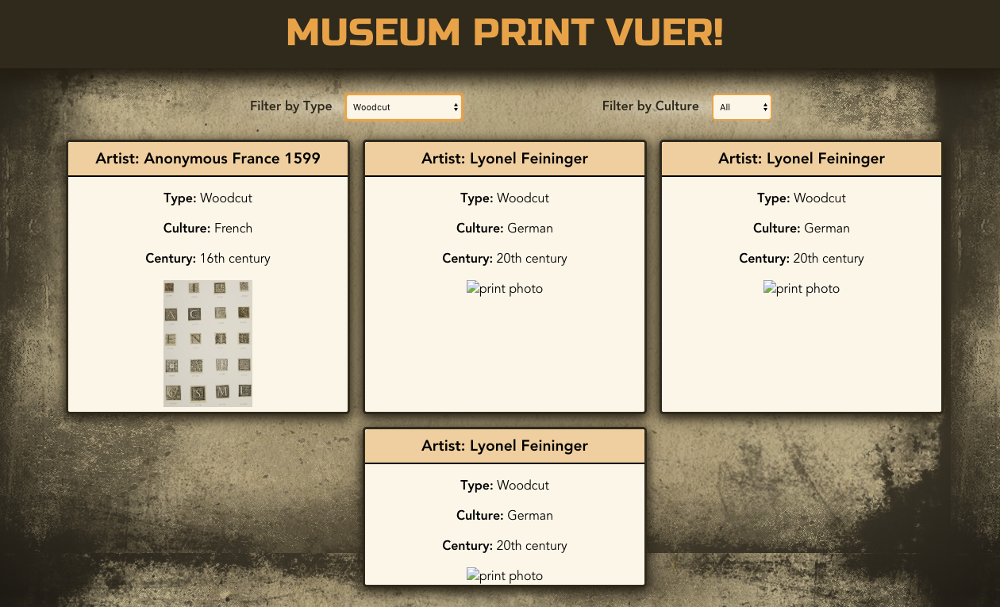

https://travis-ci.org/chrisboylen/museum-print-vuer.svg?branch=master
# Museum Print Vuer
:scroll: The purpose of this app is that it simulates an interview takehome code challenge. I was given a spec and required to use a concept/library/framework that I've never used before, which was Vue. I was given the time of a little more than 24 hours to complete this project.  I was given the [Harvard Art Museums API](https://www.harvardartmuseums.org/collections/api) and told to use some of the data to show some kind of user interaction.  I set up continuous integration testing with [Travis CI](https://travis-ci.org/). It is deployed on [Heroku](https://dashboard.heroku.com/apps) [Museum Print Vuer](https://museum-print-vuer.herokuapp.com/). It's tested with [Jest](https://jestjs.io/) using the assertion library [Enzyme](https://airbnb.io/enzyme/).

## Setup
#### Installation
1.  `git clone https://github.com/chrisboylen/museum-print-vuer.git`
1.  `cd museum-print-vuer`
1.  `npm install`
1.  `npm run serve` Compiles and hot-reloads for development
1.  `npm run build` Compiles and minifies for production

#### Run tests
1.  `npm run test`

## Result

## Contributor

- [Chris Boylen](https://github.com/chrisboylen)

